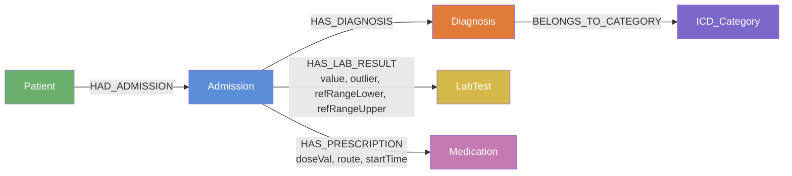
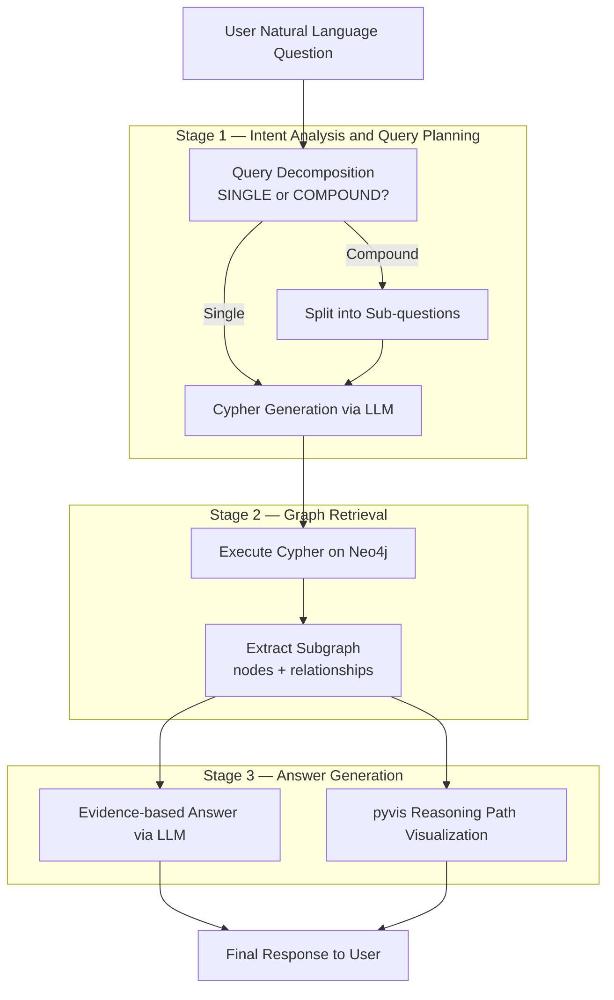

# MedGraphRAG-EHR

Healthcare Knowledge Graph for Intelligent Medical Query via Graph RAG

Inspired by [MedGraphRAG (ACL 2025)](https://arxiv.org/abs/2408.04187), this project builds a Graph RAG pipeline on top of MIMIC-IV EHR data and Neo4j. Clinical researchers and data analysts can query complex patient data in plain English — no Cypher or SQL needed.

---

## What it does

Most EHR systems require query expertise to extract useful insights. This system lets you ask questions like *"What medications are commonly prescribed for heart failure patients?"* and get back a structured, traceable answer with a visual reasoning path showing exactly how the system got there.

Under the hood: natural language goes in, the LLM generates a Cypher query, Neo4j retrieves the relevant subgraph, and the LLM synthesizes an evidence-based answer. Compound questions (e.g. "What are the diagnoses and medications for patient X?") are automatically decomposed into sub-queries and merged.

---

## Architecture

### Knowledge Graph (Two Layers)



Layer 1 is the clinical entity graph — Patient, Admission, Diagnosis, LabTest, Medication — mapped directly from MIMIC-IV structured tables. Layer 2 adds knowledge enrichment: ICD category hierarchy for disease classification, and lab reference ranges on the `HAS_LAB_RESULT` relationship for anomaly detection. This replaces the paper's three-layer UMLS setup, which is designed for unstructured text; structured EHR data doesn't need it.

### Graph RAG Pipeline (Three Stages)



---

## Example Queries

| Type | Question | What it tests |
|---|---|---|
| Single-hop fact | *How many admissions does patient p_15496609 have?* | Direct lookup |
| Anomaly detection | *How many abnormal lab results does patient p_16846280 have?* | Layer 2 reference ranges |
| Multi-hop relational | *What medications are prescribed for heart failure patients?* | 3-hop traversal via ICD category |
| Backward tracing | *What diagnoses does patient p_10253349 have in admission 26415640?* | Reverse path traversal |
| Cross-category aggregation | *What are the top 10 ICD categories by number of diagnoses?* | Graph aggregation |
| Comprehensive summary | *Give a full summary of patient p_15496609's admissions, diagnoses, and medications.* | Compound query decomposition |

---

## Tech Stack

| | |
|---|---|
| Graph Database | Neo4j |
| LLM | OpenAI GPT-3.5-turbo (dev) / GPT-4 (prod) |
| LLM Framework | LangChain |
| Frontend | Streamlit |
| Visualization | pyvis |
| ETL | Python / Pandas |
| Data | MIMIC-IV (demo: 100 patients / full: 364K patients) |

---

## Dataset Scale

|  | Nodes | Relationships |
|---|---|---|
| Demo | 4,785 | 103,649 |
| Full | 954,151 | 111,837,073 |

Full breakdown — Patient: 364,627 · Admission: 546,028 · Diagnosis: 28,581 · Medication: 10,581 · LabTest: 1,650 · ICD_Category: 2,684 · HAS_LAB_RESULT: 84.6M · HAS_PRESCRIPTION: 20.3M · HAS_DIAGNOSIS: 6.36M

---

## Project Structure

```
MedGraphRAG-EHR/
├── etl/
│   ├── config.py               # centralized config, MODE = "demo" / "full"
│   ├── eda.py                  # exploratory analysis before writing any cleaning rules
│   ├── extract.py
│   ├── transform.py            # cleaning rules derived from EDA findings
│   ├── build_graph_input.py    # outputs Neo4j-ready CSV files
│   ├── run_etl.py              # runs the full pipeline end-to-end
│   ├── lineage_decorator.py    # wraps transform functions to record provenance
│   └── quality_check.py        # 47 assertions run after every ETL run
├── llm_interface/
│   ├── config.py               # LLM_MODE = "dev" / "prod"
│   ├── graph_rag.py            # three-stage pipeline + compound query decomposition
│   ├── app.py                  # Streamlit app + pyvis subgraph rendering
│   ├── validate_results.py     # automated validation against ground-truth Cypher
│   ├── test_scenarios.py       # six query type scenarios
│   ├── check_schema.py
│   └── test_connection.py
├── lineage/
│   └── lineage.json            # transformation provenance records
├── data/
│   ├── raw/                    # MIMIC-IV demo files
│   ├── raw_full/               # MIMIC-IV full files
│   ├── cleaned/                # demo cleaned output
│   ├── cleaned_full/           # full cleaned output
│   ├── graph_input/            # demo Neo4j CSVs
│   └── graph_input_full/       # full Neo4j CSVs
└── .env                        # credentials, not committed
```

---

## Setup

**Prerequisites:** Python 3.9+, Neo4j Desktop, OpenAI API key, MIMIC-IV access ([physionet.org](https://physionet.org/content/mimic-iv/))

```bash
git clone https://github.com/your-username/MedGraphRAG-EHR.git
cd MedGraphRAG-EHR
pip install -r requirements.txt
```

Create `.env` in the project root:
```
NEO4J_URI=bolt://127.0.0.1:7687
NEO4J_USER=neo4j
NEO4J_PASSWORD=your_password
OPENAI_API_KEY=your_openai_key
```

**ETL** — set `MODE` in `etl/config.py` to `"demo"` or `"full"`, then:
```bash
python etl/run_etl.py
```

**App:**
```bash
cd llm_interface
streamlit run app.py
```

**Validation:**
```bash
cd llm_interface
python validate_results.py
```

---

## Validation

We didn't want to just show that the pipeline runs — we wanted to know if the answers are actually correct. So we built a three-layer validation framework.

Layer 1 is the ETL quality checks: 47 assertions that run after every ETL job (all pass). Layer 2 is six human-approved ground-truth Cypher queries, one per query type, verified manually in Neo4j Browser. Layer 3 is an automated script that runs each question through the full LLM pipeline and scores the output against the ground truth across three dimensions: exact match, recall/precision, and semantic equivalence judged by GPT-3.5.

| Query Type | Exact Match | Recall / Precision | Semantic |
|---|---|---|---|
| GT1 Single-hop fact | ✅ | 100% | 100 |
| GT2 Anomaly detection | ✅ | 100% | 95 |
| GT3 Multi-hop relational | — * | 100% precision * | 70 |
| GT4 Backward tracing | ✅ | 100% | 70 |
| GT5 Cross-category aggregation | ✅ | 100% | 95 |
| GT6 Comprehensive | — ** | N/A ** | 95 |

\* GT3 uses precision rather than recall — the LLM returns 20 results by design (LIMIT 20), so exact match against a 4,400-item GT set isn't meaningful. The 70 semantic score reflects a real limitation: LIMIT truncation doesn't guarantee clinical relevance ordering. Furosemide and Metoprolol are valid answers; the system happened to return Sodium Chloride first because it comes first alphabetically.

\*\* GT6 is a compound query that returns raw sub-results rather than aggregated counts, so exact match and recall don't apply.

---

## A few design notes

**EDA before cleaning** — every cleaning rule was written after looking at the actual data, not before. This caught things we wouldn't have anticipated: 107,727 lab events with no associated admission, 116 duplicate diagnosis rows, empty string vs null distinctions in lab units.

**Traversal order matters at scale** — with 84.6M `HAS_LAB_RESULT` relationships, starting a Cypher traversal from the wrong end causes Java heap OOM. We added an explicit rule to the LLM prompt: always start from the smallest node set and expand outward.

**Two layers instead of three** — the paper uses three layers because it's working with unstructured text that needs LLM-based entity extraction and disambiguation. Our data is already structured: ICD codes, standardized item IDs, drug names. Two layers cover the same ground with less complexity.

**Full-chain traceability** — the paper traces answers back to source documents and UMLS definitions. We extended this in the other direction: a `capture_lineage` decorator wraps every ETL transform function and records what was changed, when, and why. This means you can trace any value in Neo4j back to the raw MIMIC-IV file it came from.

---

## Reference

> Ke, et al. **MedGraphRAG: A Medical Graph RAG System.** ACL 2025. [arXiv:2408.04187](https://arxiv.org/abs/2408.04187)
